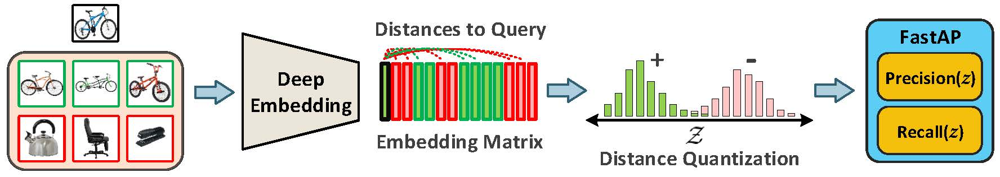

# FastAP: Deep Metric Learning to Rank
This repository contains implementation of the following paper:

[Deep Metric Learning to Rank](http://openaccess.thecvf.com/content_CVPR_2019/html/Cakir_Deep_Metric_Learning_to_Rank_CVPR_2019_paper.html) 
[Fatih Cakir](http://cs-people.bu.edu/fcakir/)\*, [Kun He](http://cs-people.bu.edu/hekun/)\*, [Xide Xia](https://xidexia.github.io), [Brian Kulis](http://people.bu.edu/bkulis/), and [Stan Sclaroff](http://www.cs.bu.edu/~sclaroff/) (*equal contribution) 
IEEE Conference on Computer Vision and Pattern Recognition (CVPR), 2019

## Usage 
* **Matlab**: see `matlab/README.md`
* **PyTorch**: see `pytorch/README.md`

## Datasets
* Stanford Online Products
  * Can be downloaded [here](http://cvgl.stanford.edu/projects/lifted_struct/)
* In-Shop Clothes Retrieval
  * Can be downloaded [here](http://mmlab.ie.cuhk.edu.hk/projects/DeepFashion.html)
* PKU VehicleID
  * Please request the dataset from the authors [here](https://pkuml.org/resources/pku-vehicleid.html)

## Reproducibility
* We provide trained [MatConvNet](https://www.vlfeat.org/matconvnet/quick/) models and experimental logs for the results in the paper. These models were used to achieve the results in the tables.
* The logs also include parameters settings that enable one to re-train a model if desired. It also includes evaluation results with model checkpoints at certain epochs .
    * Table 1: Stanford Online Products
        * FastAP, ResNet-18, M=256, Dim=512: [[model @ epoch 20](https://drive.google.com/file/d/1sPCG34rV4Bqf0aWF7GrFIDUK7DGjcaB5/view?usp=sharing), [log](https://drive.google.com/open?id=14m3fHgeZu8MIAePFHXe141R60KRwH1d8)]
        * FastAP, ResNet-50, M=96, Dim=128: [[model @ epoch 30](https://drive.google.com/open?id=1yGUVTskdERdLeF85GP-lLRnwS0KhpvvL), [log](https://drive.google.com/open?id=1A0G1aUBS7URotInbT7eBbys4xfARvCCe)]
        * FastAP, ResNet-50, M=96, Dim=512: [[model @ epoch 28](https://drive.google.com/file/d/14yEyAYhGzNygBBn8r2RcZut_Ye14mJoK/view?usp=sharing), [log](https://drive.google.com/open?id=19mpLn1OqA2nqpMZtvZ3GvFk_VppOOPTc)]
        * FastAP, ResNet-50, M=256, Dim=512: [[model @ epoch 12](https://drive.google.com/open?id=1WfV1ArXHG4oksHGE8DZRDwsxupoO60sD), [log](https://drive.google.com/open?id=1shvC5qB8O0l6vH1qa2SG1oxX8_jM1gdi)]
    * Table 2: In-Shop Clothes
        * FastAP, ResNet-18, M=256, Dim=512: [[model @ epoch 50](https://drive.google.com/open?id=1ZZ-Fpx9uPkRL-QXL-8-RcROjQVOLcbr5), [log](https://drive.google.com/file/d/1osxoHsMy11v-kvUNTuRG3luhsxMMn78B/view?usp=sharing)]
        * FastAP, ResNet-50, M=96, Dim=512: [[model @ epoch 40](https://drive.google.com/open?id=1PyiHog7fJp_InvqdAO0dzyJDRMNvAXxm), [log](https://drive.google.com/open?id=14IPgDfkbKo9PnrgMFFRDSIBRW1xwRYs5)]
        * FastAP, ResNet-50, M=256, Dim=512: [[model @ epoch 35](https://drive.google.com/open?id=1T5IynM63YqnGslnMGppJsmtJdHIWamJv), [log](https://drive.google.com/open?id=1oud9i87FTJE7Ei636bjxqgBXpahysRKK)]
    * Table 3: PKU VehicleID
        * FastAP, ResNet-18, M=256, Dim=512: [[model @ epoch 50](https://drive.google.com/open?id=1KsUF2SzkhvBOkHzbrXKj7H5KtN6Z3hRJ), [log](https://drive.google.com/open?id=155Ce-FmI6dmMgJnXdESVHx08unU3jWX2)]
        * FastAP, ResNet-50, M=96, Dim=512: [[model @ epoch 40](https://drive.google.com/open?id=1AblJelRHStBfWwmZeoRM8iEpNRNdOobn), [log](https://drive.google.com/open?id=1twswLE-j9kLxUsk5Ku7vWqBp0Sml65sG)]
        * FastAP, ResNet-50, M=256, dim=512: [[model @ epoch 30](https://drive.google.com/open?id=1MAimhKEyEfq2LDYnUaDburFH2YsUhrpA), [log](https://drive.google.com/open?id=1CtNk-wxSZToO703OvfK8ndFQzFnpOvVS)]
        
        (M=mini-batch size)
 * PyTorch code is a direct port from our MATLAB implementation. We haven't tried reproducing the paper results with our PyTorch code. **For reproducibility use the MATLAB version**. 
 * Note that the mini-batch sampling strategy must also be used alongside the FastAP loss for good results.

## Contact
For questions and comments, feel free to contact: kunhe26@gmail.com or fcakirs@gmail.com

## License
MIT
